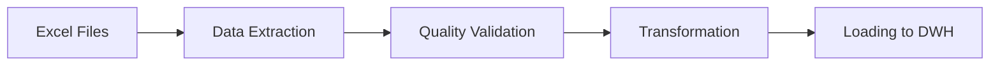

# Sales & Forecast Data Integration Project

## Project Overview

### Business Context

The company's sales and forecasting teams work with separate Excel files, each maintaining their own format. The challenge is to create a unified, quality-assured database that serves as the backend for a web application comparing sales against forecasts.

### Technical Solution

Our solution implements a robust ETL pipeline following Data Engineering best practices:

#### 1. Data Architecture

- **Dimensional Model**: Implements star schema for efficient querying

  - Fact tables: fact_sales, fact_forecast
  - Dimension tables: dim_material, dim_time, dim_region
  - Why? Optimizes for analytical queries and maintains data integrity

- **SOLID Principles in Data Engineering**:
  - Single Responsibility: Each component handles one aspect (extraction, validation, transformation)
  - Open/Closed: New data quality rules can be added without modifying existing code
  - Interface Segregation: Clear separation between data loading and processing
  - Dependency Inversion: High-level modules don't depend on low-level modules

#### 2. Data Quality Framework

- **Validation Layers**:
  - Schema validation (required columns, data types)
  - Business rule validation (e.g., net sales ≤ gross sales)
  - Cross-reference validation (material numbers consistency)
- **Quality Metrics**:
  - Completeness: Missing value detection
  - Accuracy: Value range checks
  - Consistency: Cross-reference validation
  - Timeliness: Period validation

#### 3. ETL Process



#### 4. Performance Considerations

- Incremental loading capability
- Optimized SQL schema with proper indexing
- Efficient data type handling
- Parallel processing where applicable

## Technical Implementation

### Directory Structure

```
project/
├── config/
│   ├── dev.txt         # Environment-specific configurations
│   └── data_types.yaml # Data validation rules
├── src/
│   ├── extract/        # Data extraction modules
│   ├── transform/      # Transformation logic
│   └── quality/        # Data quality framework
├── tests/              # Unit and integration tests
└── sql/               # Database schema and views
```

### Key Components

1. **Data Extraction**

   - Handles multiple file formats (Excel, CSV)
   - Error handling and logging
   - File integrity checks

2. **Data Quality Framework**

   - Rule-based validation engine
   - Custom validation rules
   - Quality reporting

3. **Data Transformation**

   - Business logic implementation
   - Data standardization
   - Aggregation rules

4. **Database Layer**
   - Star schema implementation
   - Optimized indexes
   - Materialized views for performance

## Setup and Usage

1. Environment Setup

```bash
python -m venv venv
source venv/bin/activate
pip install -r requirements.txt
```

2. Configuration

```bash
# Update config/dev.txt with file paths
# Update config/data_types.yaml with validation rules
```

3. Run Pipeline

```bash
python main.py
```

## Testing Strategy

1. **Unit Tests**

   - Data extraction validation
   - Quality rule testing
   - Transformation logic verification

2. **Integration Tests**

   - End-to-end pipeline testing
   - Database integration testing
   - Performance testing

3. **Quality Assurance**
   - Data quality metrics
   - Business rule validation
   - Cross-reference checking

## Monitoring and Maintenance

1. **Logging**

   - Detailed process logging
   - Error tracking
   - Performance metrics

2. **Quality Monitoring**
   - Data quality dashboards
   - Validation rule monitoring
   - Error rate tracking

## Future Enhancements

1. **Scalability**

   - Parallel processing implementation
   - Distributed computing capability
   - Cloud integration readiness

2. **Additional Features**
   - Real-time data processing
   - Advanced data quality rules
   - Machine learning-based anomaly detection

## Documentation

- [Database Schema](docs/schema.md)
- [API Documentation](docs/api.md)
- [Quality Rules](docs/quality_rules.md)


